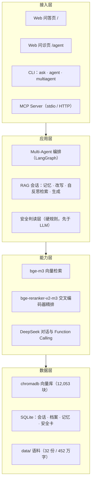
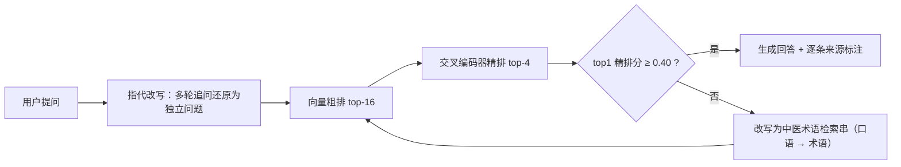
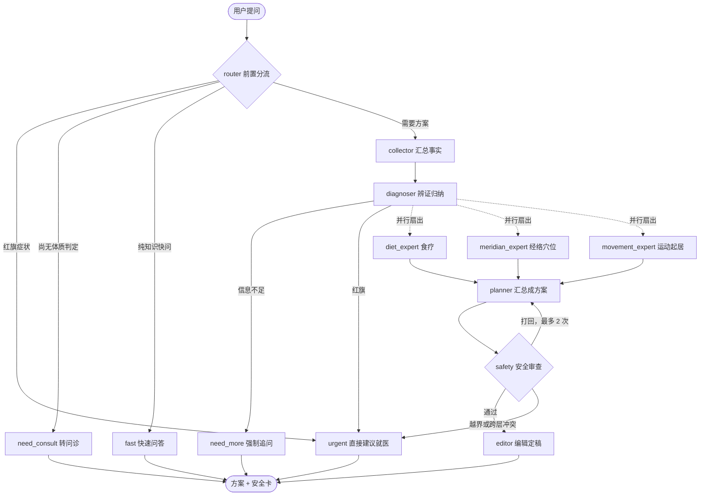

# 中医养生咨询 Agent —— 垂直领域 RAG + Multi-Agent


通用大模型**没有中医养生这块专业能力**——辨证、方剂配伍、药性禁忌是成体系的专业积累，不在通用语料里，
所以它的回答常常既错误又无据可查。本项目是一个面向中医养生咨询的垂直领域智能体：
以自建权威语料（古籍 + 现行标准，**452 万字**）为知识底座，
打通「**问诊追问 → 检索重排 → 安全审查 → 方案生成**」全链路，
并把"答错代价高"的判断从 LLM 概率链路里剥离出来。

**技术栈**：Python · FastAPI · LangGraph · chromadb · bge-m3 · bge-reranker-v2-m3 · DeepSeek（Function Calling）· SQLite · MCP

> ⚠️ **免责声明**：本项目用于技术演示与健康科普。输出内容不构成医疗诊断或用药建议，出现不适请及时就医。

---

## 目录

- [核心特性](#核心特性)
- [系统架构](#系统架构)
  - [分层结构](#分层结构)
  - [检索链路](#检索链路)
  - [Multi-Agent 编排](#multi-agent-编排)
  - [安全层：三层防线](#安全层三层防线)
- [快速开始](#快速开始)
- [配置说明](#配置说明)
- [测试与评估](#测试与评估)
- [MCP Server 接入](#mcp-server-接入)
- [项目结构](#项目结构)
- [扩充知识库](#扩充知识库)
- [常见问题](#常见问题)
- [路线图](#路线图)
- [延伸文档](#延伸文档)

---

## 核心特性

| 能力 | 说明 |
| --- | --- |
| **知识底座** | 32 份 / **12,053 块** / 452.9 万字中医语料向量库（古籍 + 现行标准 + 自建安全语料）；按文件指纹与提取器版本号**增量入库**，扩库只重算变更块 |
| **两段式检索 + 自反思** | 向量粗排 top-16 → 交叉编码器精排 top-4；**复用精排分数当检索质量传感器**，低于阈值自动改写查询重检、取历史最优（口语提问精排分 0.11 → 0.62） |
| **Multi-Agent 编排** | 四通道前置分流 + 五角色流水线 + 三专科专家**并行扇出**；安全审查持一票否决权，打回重规划上限 2 次后降级输出——异常时也不会没有方案 |
| **安全层（独立于 RAG）** | 毒性中药 / 慢病西药冲突 / 特殊人群**硬编码规则库**，在 LLM 之前优先路由；危险等级五档，命中即给「能做 / 不能做 / 需先确认」判读，**不看语料覆盖、也不问模型置信度** |
| **三层记忆** | 近期原文（保真）+ 早期纪要（压缩保量）+ 跨会话档案与长期记忆（保值）；记忆按会话作用域隔离 |
| **接诊档案与追问** | 规则化抽取年龄/性别/慢病/西药/在服中药食疗；缺舌象、寒热、二便等最小充分条件时**强制追问，信息补齐前不给方剂级内容** |
| **多格式语料管线** | `.md` 结构化切块 / `.txt` 自动识别 5 种编码 / 影印本 PDF 自动降级 OCR（逐页断点续跑） |
| **全链路持久化** | 会话、消息、问诊状态、用户档案、长期记忆、**每轮安全判读**全落 SQLite，重启不丢（刷新页面安全提示仍在） |
| **MCP 协议化出口** | 把检索、体质判定、缺口识别、安全审查封装为 **4 个标准工具 + 3 个只读资源**，支持 stdio 与 HTTP 两种模式 |
| **可验证** | 130+ 断言的三层测试（工具逻辑 / 协议 / 部署配置）+ **12 项零 API 回归** + 42 条评估集 |

## 系统架构

### 分层结构



三个设计取向贯穿全项目：

1. **确定性的归代码，语义的归模型**——禁忌、档位、信息缺口这类"有唯一答案、答错代价高"的判断全部落在规则与代码里，LLM 只负责理解与表达。
2. **失败要留痕**——降级可以，但不能无声。所有兜底分支必须打印堆栈，否则"功能没生效"会被伪装成"这次没有风险"。
3. **判定口径单一来源**——同一语义只在一处定义（如档位由 `safety/tiers.py` 单点派生），避免多处实现各自漂移。

### 检索链路

**离线建库**（`python -m app.index`）：

```
语料 → Unicode 归一化（清部首码位污染）→ 切块 → bge-m3 向量化 → 两阶段写入 chromadb
```

增量策略：以**文件指纹 + 提取器版本号**做 manifest 比对，只重算变更文件的块；改切块逻辑时必须把
`app/index.py::EXTRACTOR_VERSION` +1，否则新旧块会混在同一个库里静默沿用旧向量。

**在线检索**（`python -m app.rag` / Web）：



自反思闭环的取舍：**不额外训练 critic 模型，直接复用链路里已有的精排分数当质量信号**；
重检最多 2 轮并取历史最优，避免"改写本身引入了新风险"。

### Multi-Agent 编排

图结构与 `python -m app.multiagent --graph` 输出的边关系一一对应：



- **前置分流是三层的**：规则管安全（红旗短路，不经 LLM）→ LLM 管意图（完整流水线 / 快速问答）→ 代码管前置条件（想要方案但没测体质 → 先转问诊）。
- **三专科专家同一超步并发**（LangGraph 条件边返回列表），扇入 `planner` 只跑一次，耗时约等于最慢的一个专家。
- **否决回环有上限**：安全审查打回重规划最多 2 次，超限进降级输出——质量守门但不死锁。

### 安全层：三层防线

| 防线 | 位置 | 拦什么 |
| --- | --- | --- |
| ① 规则库前置路由 | 任何 LLM 调用**之前** | 毒性药材、特殊人群、慢病用药冲突；命中直接给判读，模型无权改写结论 |
| ② 零-LLM 确定性汇总 | 主控节点 | 多专家结论合并成稿时，档位与冲突结论由代码拼装，不经过模型润色 |
| ③ 交付前程序化校验 | 出口 | 六模块完整性、档位一致性、引用可采信性、药名外泄守卫；**有违规或红旗时一律不放行** |

危险等级五档：`forbid` / `not_needed` / `confirm` / `conditional` / `ok`，
判定口径是「**自行食用或自行加用**」，不含医师辨证处方。

## 快速开始

### 环境要求

- Python **3.12**
- 两个 API Key：DeepSeek（对话）、SiliconFlow（bge-m3 向量 + 重排）
- 可选：影印本 PDF 走 OCR 时需要 `pypdfium2` + `rapidocr_onnxruntime`

### 安装

```bash
git clone https://github.com/djp0417/tcm-rag-agent.git
cd tcm-rag-agent

conda create -n rag-agent python=3.12 -y
conda activate rag-agent
pip install -r requirements.txt -i https://pypi.tuna.tsinghua.edu.cn/simple
```

### 配置

```bash
cp .env.example .env      # Windows: copy .env.example .env
# 编辑 .env，填入 DEEPSEEK_API_KEY / SILICONFLOW_API_KEY
python check_env.py       # 验证依赖版本 + 两个 API 连通性
```

### 建库与运行

> 所有入口都必须用 **`python -m 模块名`** 方式运行（`python app/xxx.py` 会 import 失败）。

```bash
python -m app.index --report-only --no-ocr   # 只出《语料构成报告》，不写库、零 API 消耗
python -m app.index                          # 建库（影印本自动 OCR，耗时较长）

python -m app.server                         # Web：问答 http://127.0.0.1:7860 ；问诊 /agent
python -m app.server --port 7861             # 7860 被占时换端口（启动会先做端口预检）
python -m app.ask -q "阳虚体质有什么表现"     # CLI 单次提问
python -m app.ask                            # CLI 交互多轮
python -m app.agent --demo                   # CLI 自动跑一遍完整体质辨识
```

### Multi-Agent 流水线

```bash
python -m app.multiagent --selftest          # 控制流自检（秒级、零 API，先跑这个）
python -m app.multiagent --graph             # 打印流程图（mermaid）
python -m app.multiagent --list              # 列出可用于流水线的会话
python -m app.multiagent --conv 13 "帮我出一份完整的调理方案"
```

## 配置说明

| 变量 | 用途 | 说明 |
| --- | --- | --- |
| `DEEPSEEK_API_KEY` | 对话模型 `deepseek-chat`（temperature=0） | 必填 |
| `SILICONFLOW_API_KEY` | `BAAI/bge-m3` 向量化（1024 维）与 `BAAI/bge-reranker-v2-m3` 重排 | 必填 |

`.env` 只从**项目根目录**读取（`app/llm.py`、`app/embed.py`、`app/rerank.py` 三处加载），且已被
`.gitignore` 排除——**请勿提交或外发**。除这两个 Key 外无其他必填配置。

## 测试与评估

```bash
# 零 API 回归（不发一次请求，秒级）
python -m tools.test_architecture        # 架构层五条验收
python -m tools.test_precision           # 精度与稳定性 55 项
python -m tools.test_safety_rules        # 安全规则层（在服用判定 / 停药识别）
python -m tools.test_inquiry             # 追问引擎（意图闸门 / 兜底）
python -m tools.test_memory_isolation    # 记忆隔离（新会话无记忆 / 显式回忆通道）
python -m tools.test_origin_gating       # 命中来源分流
python -m tools.test_mcp_tools           # MCP 工具层 71 项
python -m tools.test_mcp_server          # MCP 协议层 42 项（真起子进程走 JSON-RPC）
python -m tools.verify_mcp_config        # MCP 部署校验 26 项（照宿主配置启动）
python -m app.multiagent --selftest      # 多 Agent 控制流 A~I 共 9 段
python -m app.eval --validate            # 测试集与语料一致性校验

# 真机端到端（需先起临时实例，会打真实 API）
python -m app.server --port 7862
E2E_PORT=7862 python -m tools.e2e_safety_check
E2E_PORT=7862 python -m tools.test_fresh_session
E2E_PORT=7862 python -m tools.test_plan_endpoint
```

> ⚠️ **"零 API" ≠ "不需要 Key"**：上面这些命令不会发起任何请求，但 `app/embed`、`app/llm` 在 **import 期**
> 就会构造客户端，`.env` 没配好会直接抛 `Missing credentials`——看起来像测试挂了，实际是环境没配。

**量化评估**：`eval/testset.jsonl` 共 42 条（域内 37 / 域外 5），覆盖体质 / 四季起居 / 素问 / 灵枢 /
难经 / 本草食养 / 抱朴子 / 千金方（OCR）/ 口语化追问 / 域外拒答十类。
```bash
python -m app.eval --validate     # 先校验测试集（标注写错是评估失真的最大来源）
python -m app.eval --retrieval    # 仅检索指标（含自反思对照）
python -m app.eval --full         # 四项全跑，出 JSON + Markdown 报告
```

| 指标 | 回答什么问题 |
| --- | --- |
| **金标块召回 kw_hit@4** | 这个块真的召回对了吗（书级粒度太粗，这条才是主指标） |
| recall@1 / 书级 recall@4 / MRR | 命中哪本书、排在第几 |
| 答案忠实度 | 有没有幻觉（LLM-as-judge：每条论断能否在参考资料溯源） |
| 拒答正确率 | 域外该拒，域内**误拒同样算失败** |
| 长期记忆保持率 | 第 1 轮说过的话，第 9 轮和新建会话还记得吗 |

历史基线（4345 块库）：自反思检索把 **金标块召回从 81.1% 提升到 89.2%（+8.1pt）**、
关键词覆盖 +8.1pt、MRR 0.887 → 0.914，域外拒答 100%。
指标定义、实测明细与"评估驱动的修复闭环"见 [评估体系](docs/评估体系.md)。

## MCP Server 接入

把领域能力做成标准协议出口，让支持 MCP 的宿主（WorkBuddy / Claude Desktop / 各类 IDE 客户端）直接调用：

```bash
python -m app.mcp                  # stdio 模式（宿主拉起的标准方式）
python -m app.mcp --http           # HTTP 模式，只绑 127.0.0.1:7863
```

| 工具 | 作用 |
| --- | --- |
| `tcm_search` | 语料检索（返回带来源的片段，含自反思重检） |
| `tcm_constitution` | 九分法体质辨识（27 题得分 → 主体质 / 兼夹 / 调养要点） |
| `tcm_intake_gaps` | 算信息缺口并给建议追问（上限 3 条） |
| `tcm_safety_check` | 安全判读（药材 / 食材 / 西药 × 状态 → 五档结论） |

只读资源：`tcm://kb/manifest`（语料清单）、`tcm://guide/scope`（能力边界与红旗症状）、
`tcm://session/{id}`（会话档案）。

宿主配置示例（stdio）：

```json
{
  "mcpServers": {
    "tcm-kb": {
      "command": "<你的 python 绝对路径>",
      "args": ["-m", "app.mcp"],
      "env": {
        "PYTHONPATH": "<本项目根目录的绝对路径>",
        "PYTHONIOENCODING": "utf-8"
      }
    }
  }
}
```

两个必须注意的点（踩过的坑）：

- **`PYTHONPATH` 不能省**：`python -m` 的 import 发生在进入包内 `os.chdir` 之前，光靠代码自切目录救不了"找不到包"。
- **stdio 模式下 stdout 是协议流**：任何 `print` 都会污染它，宿主机报的却往往是"JSON 解析错误"，离原因很远——所以本项目日志一律走 stderr。

## 项目结构

```
rag-agent-app/
├─ check_env.py            # Step 0：依赖版本 + 两个 API 连通性自检
├─ app/
│  ├─ rag.py               # RAG 会话：三层记忆 + 改写 + 自反思检索 + 生成
│  ├─ selfrag.py           # ★ 自反思检索：精排分数驱动查询改写与重检索
│  ├─ index.py             # 建库：归一化 → 切块 → 向量化 → 两阶段写入 Chroma
│  ├─ textfix.py           # ★ 中文 PDF 部首码位污染归一化（数据库前必跑）
│  ├─ paths.py             # ★ chroma 库路径工具（规避中文绝对路径缺陷）
│  ├─ memory.py            # 三层记忆（含语义去重）
│  ├─ intake.py            # 接诊层：档案抽取 / 一致性校验 / 跨轮时间线 / 信息缺口
│  ├─ inquiry.py           # ★ 追问引擎：意图闸门 + 程序化兜底
│  ├─ contract.py          # ★ 输出契约：模块自检 + 档位一致性 + 药名外泄守卫
│  ├─ credentials.py       # 引用可采信性：剔除迷信 / 巫术性记载
│  ├─ storage.py           # SQLite 七张表
│  ├─ server.py            # FastAPI：会话 CRUD + 问答 SSE + 问诊 SSE + 记忆面板
│  ├─ safety/              # ★ 安全层：规则库 / 扫描器 / 五档分级引擎 / 话术层
│  ├─ agent/              # ★ 体质辨识 Agent：量表内核 / 状态机 / function calling 主循环
│  ├─ multiagent/          # ★ 多 Agent 流水线：状态 schema / 提示词 / 节点 / 确定性护栏 / 图装配
│  └─ mcp/                 # ★ MCP Server：对外契约文案 / 工具纯函数 / 只读资源 / 装配
├─ tools/                  # 回归脚本（不在主链路里，专门用来"证明它真的对"）
├─ web/                    # 问答页与问诊页（原生 HTML/JS 单文件，无构建依赖）
├─ data/                   # 知识库原文（见 data/README.md）
├─ store/                  # chroma 向量库 + chat.db + OCR 缓存（均不入库）
└─ docs/                   # 设计文档、开发纪实、踩坑实录、评估体系
```

## 扩充知识库

把资料放进 `data/`，重跑 `python -m app.index` 即可增量入库。

| 格式 | 说明 |
| --- | --- |
| `.md` | 首选。带 `## 标题` 的结构化文档切块时自动获得篇章元数据 |
| `.txt` | 自动识别 5 种编码（utf-8 / gbk / gb18030 / big5 / utf-8-sig） |
| `.pdf` | 文字版直接抽取；**影印本自动走 OCR**（逐页断点续跑，结果磁盘缓存） |

三条纪律：

1. **中文 PDF 入库前先做 Unicode 归一化**——部分 PDF 文本层会把字形映射到 Unicode「部首区」（`⼈` ≠ `人`），
   本项目实测曾导致 **33.9% 的块检索失效、5 本古籍 100% 中招**，修法是数据库前统一跑 `app/textfix.py`。
2. **改了切块或归一逻辑，必须把 `EXTRACTOR_VERSION` +1**，否则 manifest 对不上，旧被静默沿用。
3. **入库后跑一次 `python -m app.eval --validate`**，确认零残留。

⚠️ **语料版权**：仓库**不包含**原书 PDF（多为现代出版物与国家标准，公开再分发有版权风险）。
`data/` 里只保留 6 篇自建知识卡片作为示例，其余请自行获取——清单与获取途径见
[语料扩充书单](docs/语料扩充书单.md)，说明见 [data/README.md](data/README.md)。

## 常见问题

| 现象 | 处理 |
| --- | --- |
| `ModuleNotFoundError: langchain` | 没激活环境，或没用 `python -m` 模块方式运行 |
| 401 / invalid api key | `.env` 没建或 Key 填错；先跑 `python check_env.py` |
| `Error loading hnsw index` | 违反 chromadb 铁律：打开库必须走 `app.paths.chroma_store_path()`（相对路径），且建库期不能混入网络请求 |
| 召回内容答非所问 | 确认 `app/embed.py` 有 `check_embedding_ctx_length=False`（见 [踩坑实录](docs/踩坑实录.md)），然后重建库 |
| 语料里明明有这个词却搜不到 | 大概率是 PDF 部首码位污染；跑 `--validate` 看残留，重建库即可 |
| `python -m app.index` 每次都全量重跑 | 检查 `store/ingest_manifest.json` 是否被删；对不上就 `--rebuild` 一次，之后即增量 |
| 页面一直转圈但日志刷 200 OK | SSE 锁被客户端断开焊死；查 `store/chat.db` 有无 assistant 消息，详见 [踩坑实录](docs/踩坑实录.md) |
| 端口 10048（7860 被占） | 多半是上次服务没退干净；`python -m app.server --port 7861`，启动预检会提示怎么查 PID |

## 路线图

- [x] 阶段 0：高质量 RAG 基座（两段式检索 / 多轮改写 / 持久化 Web / 多格式语料）
- [x] 阶段 1：语料补全（10 部典籍 + 影印本 OCR + 多编码兼容）
- [x] 阶段 2：问诊 Agent（体质辨识状态机 + 自反思检索 + 长期记忆）
- [x] 阶段 3：量化评估体系（固定测试集与判分口径）
- [x] 阶段 4：Multi-Agent 协作（四通道分流 + 五角色流水线 + 三专家并行扇出，LangGraph 编排）
- [x] 阶段 5：安全层（独立于 RAG 的硬规则判读 + 五档分级 + 交付前程序化校验）
- [x] 阶段 6：MCP Server（4 工具 + 3 资源，stdio / HTTP 双模式）
- [ ] 阶段 7：知识库持续扩充（第二批权威语料入库、gold 重标注、链路级评估补全）

## 延伸文档

| 文档 | 内容 |
| --- | --- |
| [开发纪实](docs/开发纪实.md) | 各阶段的实现细节与迭代过程：每一步为什么这么做、怎么验证的 |
| [踩坑实录](docs/踩坑实录.md) | 五个**静默故障**的定位与修复：被吞掉的异常、PDF 码位污染、SSE 锁死、chromadb/Windows 铁律、第三方 embedding 端点差异 |
| [评估体系](docs/评估体系.md) | 指标定义、实测结果与"测 → 改 → 复测"的修复闭环 |
| [多 Agent 设计方案](docs/阶段4-多Agent设计方案.html) | 就绪度评估、角色定义、共享状态 schema、图结构与落地步骤 |
| [MCP 封装与接入方案](docs/reports/05-MCP封装与接入实施方案.html) | 四工具契约设计、部署方式与实测踩坑 |
| [语料扩充书单](docs/语料扩充书单.md) | 第二批语料清单（含获取途径与版权分层建议） |
| [首跑样例](docs/samples/阶段4-首跑样例-阳虚失眠.md) | 真实链路跑批记录（阳虚质失眠） |

## 许可

[MIT](LICENSE) © 丁建鹏
